# React Mini Projects

This repository contains 8 mini projects built with React. Each project is a standalone application showcasing a specific concept or functionality.

## Projects

1. **Project 1**: ReactFacts : Dark mode.

   
   
   ReactFacts : light mode

   

2. **Project 2**: card
   
   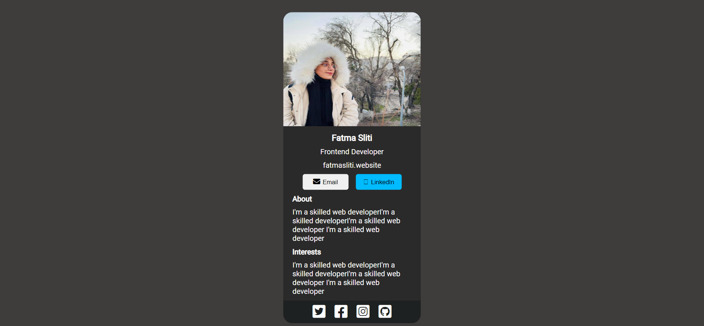

3. **Project 3**: contact

   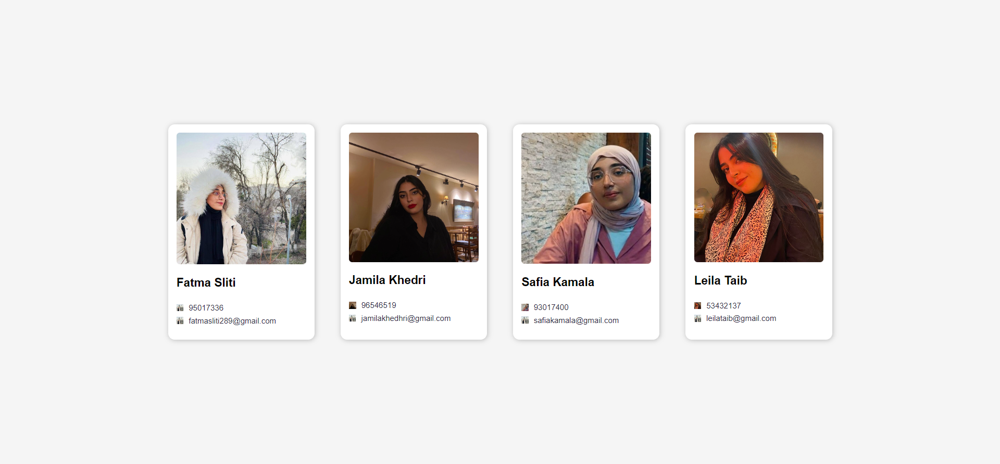
   
4. **Project 4**: airbnb (named thirdproject).

   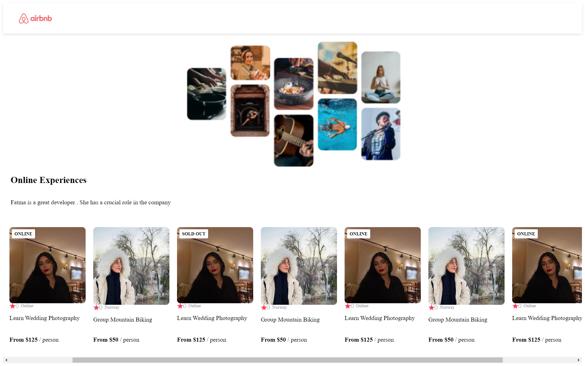

5. **Project 5**: counter.

   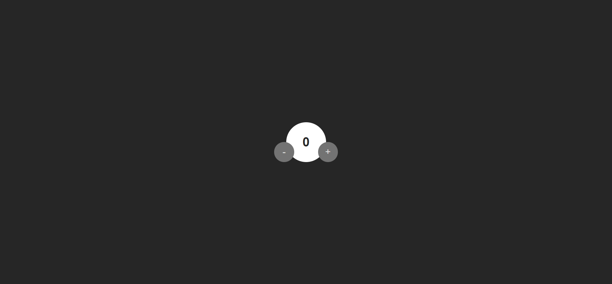

6. **Project 6**: stateobjects.

   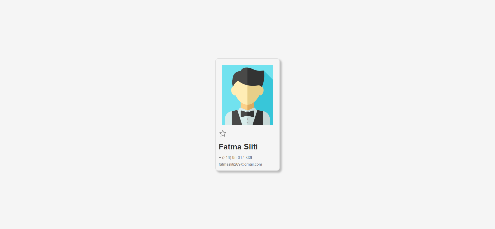

   After clicking on the star :

    

8. **Project 6**: ternary.

   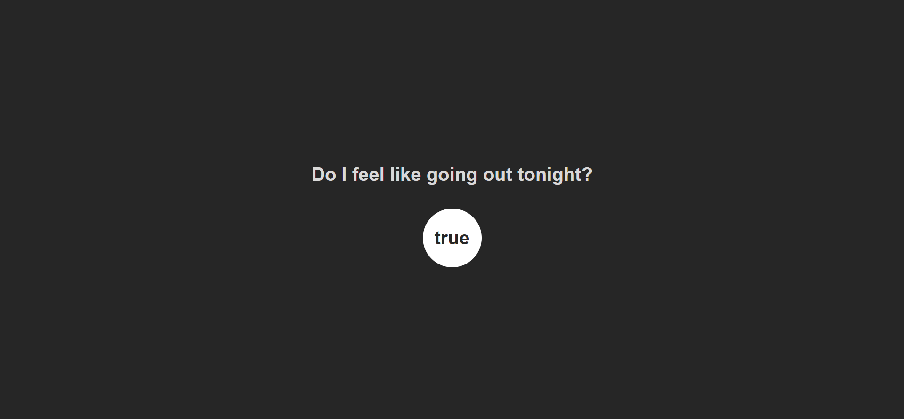

9. **Project 7**: jokes.

   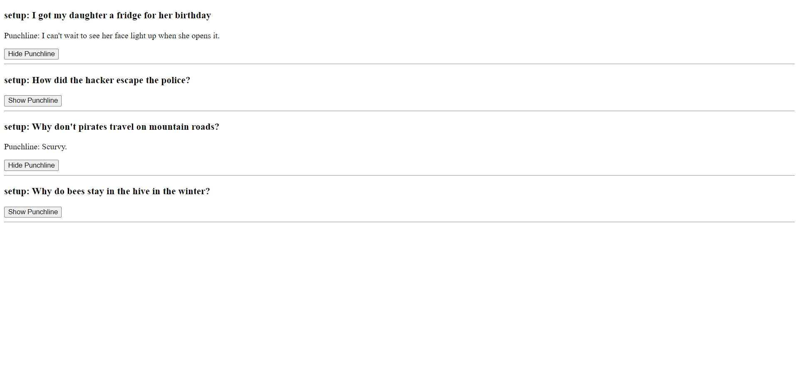

10. **Project 8**: addthings.

   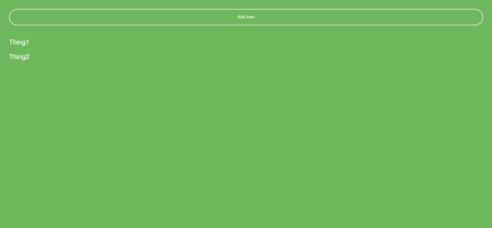
   After clicking on the add button:
   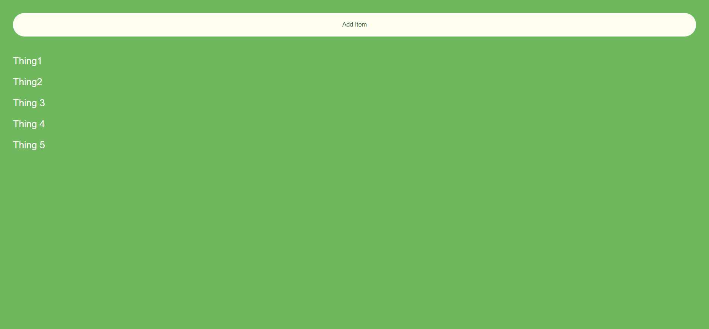

11. **Project 9**: sign up page.

   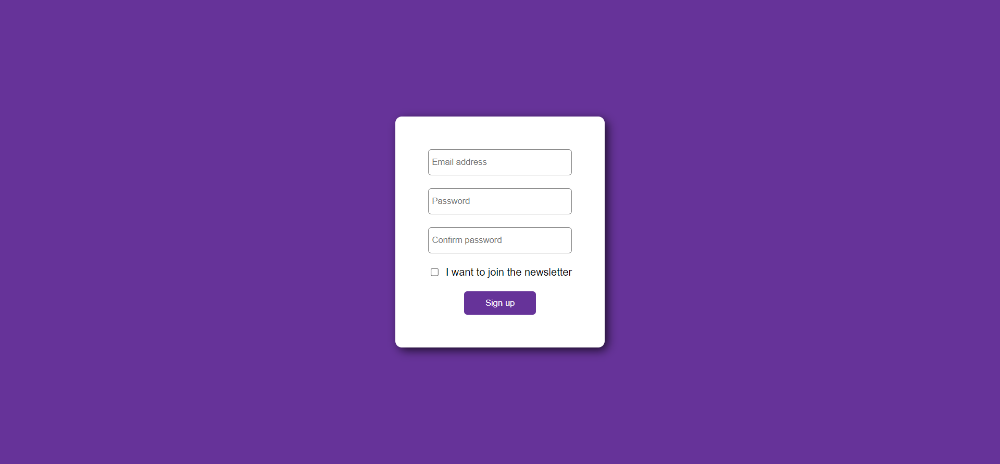

12. **Project 10**: useeffect.

   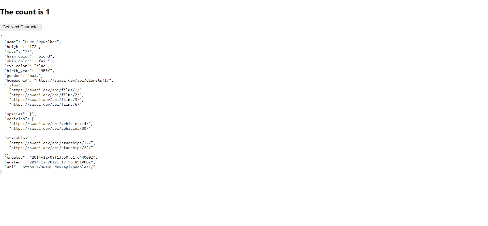
   After incrementing the counter
   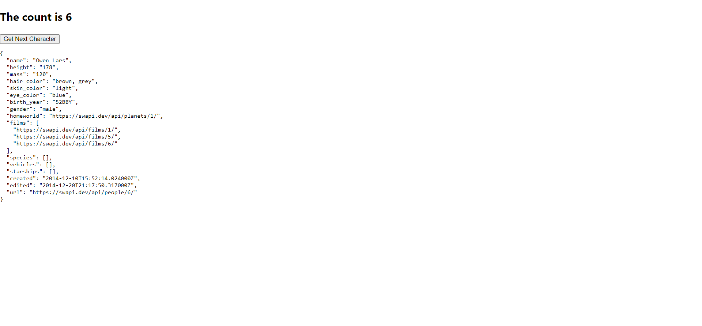

13. **Project 11**: meme generator.

   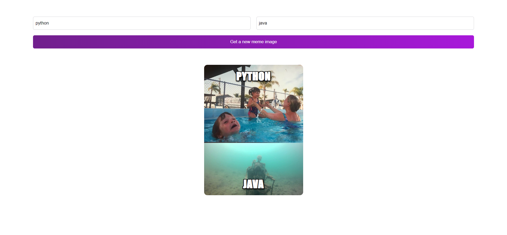

## Technologies Used

- React
- HTML
- CSS

  ## Contact

For any questions or feedback, please contact [fatmasliti289@gmail.com](mailto:fatmasliti@gmail.com).
