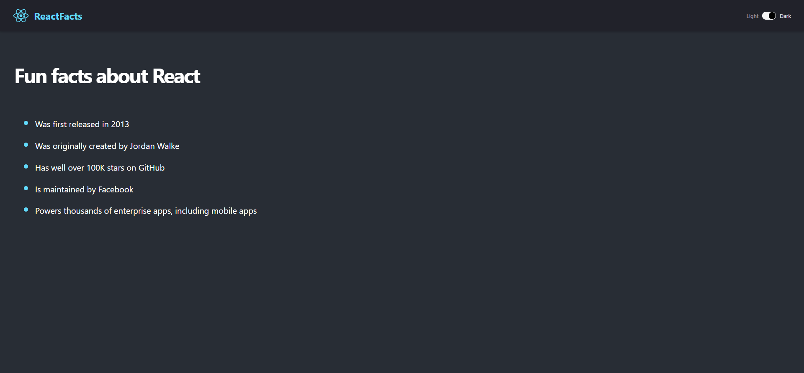
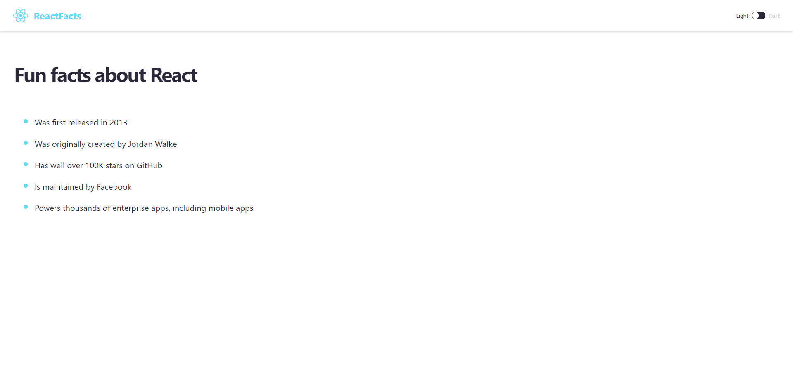

# React Mini Projects

This repository contains 8 mini projects built with React. Each project is a standalone application showcasing a specific concept or functionality.

## Projects

1. **Project 1**: ReactFacts : Dark mode.

   
   
   ReactFacts : light mode

   

3. **Project 2**: Description of Project 2.

   

4. **Project 3**: Description of Project 3.

   

5. **Project 4**: Description of Project 4.

   

6. **Project 5**: Description of Project 5.

   

7. **Project 6**: Description of Project 6.

   

8. **Project 7**: Description of Project 7.

   

9. **Project 8**: Description of Project 8.

   

## Getting Started

1. Clone the repository:

